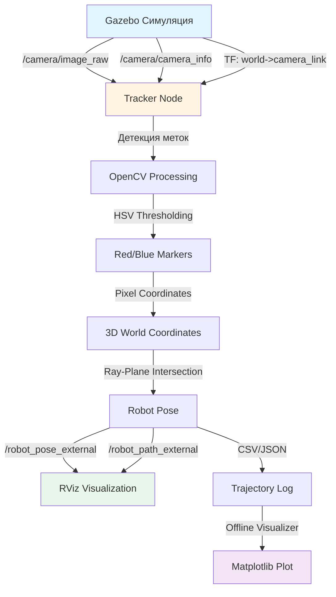
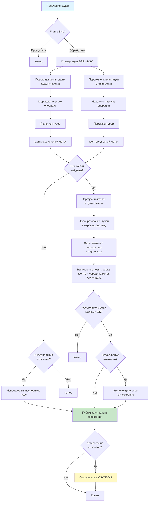

# Архитектура системы трекинга робота

## Общая схема работы системы



## Детальный пайплайн обработки кадра



## Схема преобразования координат

```
┌─────────────────────────────────────────────────────────────┐
│                    ПИКСЕЛЬНЫЕ КООРДИНАТЫ                     │
│                    (u, v) в изображении                       │
└────────────────────────┬────────────────────────────────────┘
                         │
                         ▼
         ┌───────────────────────────────┐
         │  Camera Intrinsics (K matrix) │
         │  fx, fy, cx, cy               │
         └───────────────┬───────────────┘
                         │
                         ▼
         ┌───────────────────────────────┐
         │  Нормализованные координаты   │
         │  x_norm = (u - cx) / fx       │
         │  y_norm = (v - cy) / fy       │
         └───────────────┬───────────────┘
                         │
                         ▼
         ┌───────────────────────────────┐
         │  Направление луча в системе    │
         │  камеры: [x_norm, y_norm, 1]  │
         └───────────────┬───────────────┘
                         │
                         ▼
         ┌───────────────────────────────┐
         │  TF Transform                 │
         │  world -> camera_link         │
         │  (rotation + translation)     │
         └───────────────┬───────────────┘
                         │
                         ▼
         ┌───────────────────────────────┐
         │  Направление луча в мировой    │
         │  системе координат             │
         └───────────────┬───────────────┘
                         │
                         ▼
         ┌───────────────────────────────┐
         │  Ray-Plane Intersection        │
         │  Плоскость: z = ground_z       │
         │  Решение: P = cam_pos + t*ray  │
         └───────────────┬───────────────┘
                         │
                         ▼
         ┌───────────────────────────────┐
         │      МИРОВЫЕ КООРДИНАТЫ        │
         │      (x, y, z) в метрах       │
         └───────────────────────────────┘
```

## Поток данных в системе

```
┌──────────────┐
│   Gazebo     │
│  Симуляция   │
└──────┬───────┘
       │
       ├─── /camera/image_raw (sensor_msgs/Image)
       ├─── /camera/camera_info (sensor_msgs/CameraInfo)
       └─── /tf_static: world -> camera_link
       │
       ▼
┌─────────────────────────────────────┐
│        Tracker Node                 │
│  ┌───────────────────────────────┐  │
│  │  Image Callback              │  │
│  │  - Frame skipping             │  │
│  │  - Marker detection           │  │
│  │  - Coordinate transformation │  │
│  │  - Pose computation          │  │
│  │  - Interpolation             │  │
│  └───────────────────────────────┘  │
└───────┬─────────────────────────────┘
        │
        ├─── /robot_pose_external (geometry_msgs/PoseStamped)
        ├─── /robot_path_external (nav_msgs/Path)
        ├─── /debug/image (sensor_msgs/Image)
        └─── Trajectory Log (CSV/JSON)
        │
        ▼
┌──────────────┐         ┌──────────────────┐
│     RViz     │         │ Offline          │
│ Визуализация │         │ Visualizer       │
│   (онлайн)   │         │ (Matplotlib)     │
└──────────────┘         └──────────────────┘
```

## Компоненты системы

### 1. Gazebo Симуляция (sim_pkg)

```
┌─────────────────────────────────────────┐
│           Gazebo World                  │
│  ┌───────────────────────────────────┐  │
│  │  Arena World                      │  │
│  │  - Ground plane (z=0)             │  │
│  │  - Lighting                       │  │
│  └───────────────────────────────────┘  │
│  ┌───────────────────────────────────┐  │
│  │  External Camera                  │  │
│  │  - Position: (0, 0, 2.0)          │  │
│  │  - Orientation: pitch=30°          │  │
│  │  - Resolution: 640x480             │  │
│  │  - FOV: 60°                        │  │
│  └───────────────────────────────────┘  │
│  ┌───────────────────────────────────┐  │
│  │  Robot with Markers               │  │
│  │  - Red marker (head/front)        │  │
│  │  - Blue marker (tail/back)        │  │
│  └───────────────────────────────────┘  │
└─────────────────────────────────────────┘
```

### 2. Tracker Node (tracker_pkg)

```
┌─────────────────────────────────────────┐
│         Tracker Node                   │
│  ┌──────────────────────────────────┐ │
│  │  Subscribers:                     │ │
│  │  - /camera/image_raw              │ │
│  │  - /camera/camera_info            │ │
│  └──────────────────────────────────┘ │
│  ┌──────────────────────────────────┐ │
│  │  Processing Pipeline:            │ │
│  │  1. Frame skipping                │ │
│  │  2. HSV color detection           │ │
│  │  3. Contour finding               │ │
│  │  4. Centroid calculation         │ │
│  │  5. Pixel to world transform      │ │
│  │  6. Pose computation              │ │
│  │  7. Interpolation (if needed)    │ │
│  └──────────────────────────────────┘ │
│  ┌──────────────────────────────────┐ │
│  │  Publishers:                     │ │
│  │  - /robot_pose_external          │ │
│  │  - /robot_path_external          │ │
│  │  - /debug/image                  │ │
│  └──────────────────────────────────┘ │
│  ┌──────────────────────────────────┐ │
│  │  Trajectory Logging:             │ │
│  │  - CSV/JSON export               │ │
│  └──────────────────────────────────┘ │
└─────────────────────────────────────────┘
```

## Алгоритм детекции меток

```
Изображение (BGR)
    │
    ▼
Конвертация в HSV
    │
    ▼
Пороговая фильтрация
    ├─── Красная метка: H=[0-10], S=[100-255], V=[100-255]
    └─── Синяя метка:   H=[100-130], S=[100-255], V=[100-255]
    │
    ▼
Морфологические операции
    ├─── Opening (удаление шума)
    └─── Closing (заполнение пробелов)
    │
    ▼
Поиск контуров (cv2.findContours)
    │
    ▼
Фильтрация по площади
    ├─── min_contour_area <= area <= max_contour_area
    └─── Выбор наибольшего контура
    │
    ▼
Вычисление центроида
    └─── M["m10"]/M["m00"], M["m01"]/M["m00"]
    │
    ▼
Пиксельные координаты (u, v)
```

## Формат данных траектории

### CSV формат:

```csv
t,x,y,theta,frame
0.000,0.0,0.0,0.0,0
0.033,0.1,0.05,0.1,1
0.066,0.2,0.1,0.2,2
...
```

### JSON формат:

```json
[
  {
    "t": 0.0,
    "x": 0.0,
    "y": 0.0,
    "theta": 0.0,
    "frame": 0
  },
  {
    "t": 0.033,
    "x": 0.1,
    "y": 0.05,
    "theta": 0.1,
    "frame": 1
  }
]
```

## Конфигурационные параметры

```
┌─────────────────────────────────────┐
│     tracker.yaml                    │
├─────────────────────────────────────┤
│ Frame skipping:                     │
│   frame_skip: 1                     │
│                                     │
│ HSV thresholds:                     │
│   red_hsv: [0,100,100] - [10,255,255]│
│   blue_hsv: [100,100,100] - [130,255,255]│
│                                     │
│ Contour filtering:                  │
│   min_contour_area: 50              │
│   max_contour_area: 10000           │
│                                     │
│ Interpolation:                      │
│   enable_interpolation: true        │
│   max_lost_frames: 10               │
│                                     │
│ Pose smoothing:                     │
│   enable_pose_smoothing: false      │
│   pose_smoothing_alpha: 0.2         │
│                                     │
│ Trajectory logging:                 │
│   log_trajectory: true              │
│   log_format: csv                   │
│   log_file: ~/tracker_logs/trajectory.csv│
└─────────────────────────────────────┘
```

## Последовательность запуска

```
1. Запуск Gazebo симуляции
   └─> roslaunch sim_pkg sim.launch
       ├─> Загружает arena.world
       ├─> Спавнит робота с метками
       └─> Публикует camera topics и TF

2. Запуск Tracker Node
   └─> roslaunch tracker_pkg tracker.launch
       ├─> Подписывается на camera topics
       ├─> Начинает обработку кадров
       └─> Публикует pose и path

3. Запуск RViz (опционально)
   └─> rosrun rviz rviz -d tracker.rviz
       └─> Визуализация траектории

4. Остановка
   └─> Ctrl+C
       └─> Tracker сохраняет траекторию в CSV/JSON

5. Оффлайн визуализация
   └─> rosrun tracker_pkg offline_visualizer.py trajectory.csv --interactive
```

## Обработка последовательности изображений

```
┌─────────────────────────────────────┐
│  Папка с изображениями              │
│  - frame_000.jpg                    │
│  - frame_001.jpg                    │
│  - frame_002.jpg                    │
│  ...                                │
└──────────────┬──────────────────────┘
               │
               ▼
┌─────────────────────────────────────┐
│  process_image_sequence.py          │
│  - Загрузка изображений             │
│  - Детекция меток                   │
│  - Вычисление траектории            │
└──────────────┬──────────────────────┘
               │
               ▼
┌─────────────────────────────────────┐
│  Траектория (CSV/JSON)             │
└──────────────┬──────────────────────┘
               │
               ▼
┌─────────────────────────────────────┐
│  offline_visualizer.py              │
│  - Визуализация траектории          │
│  - Интерактивный ползунок           │
│  - Показ координат при клике        │
└─────────────────────────────────────┘
```
