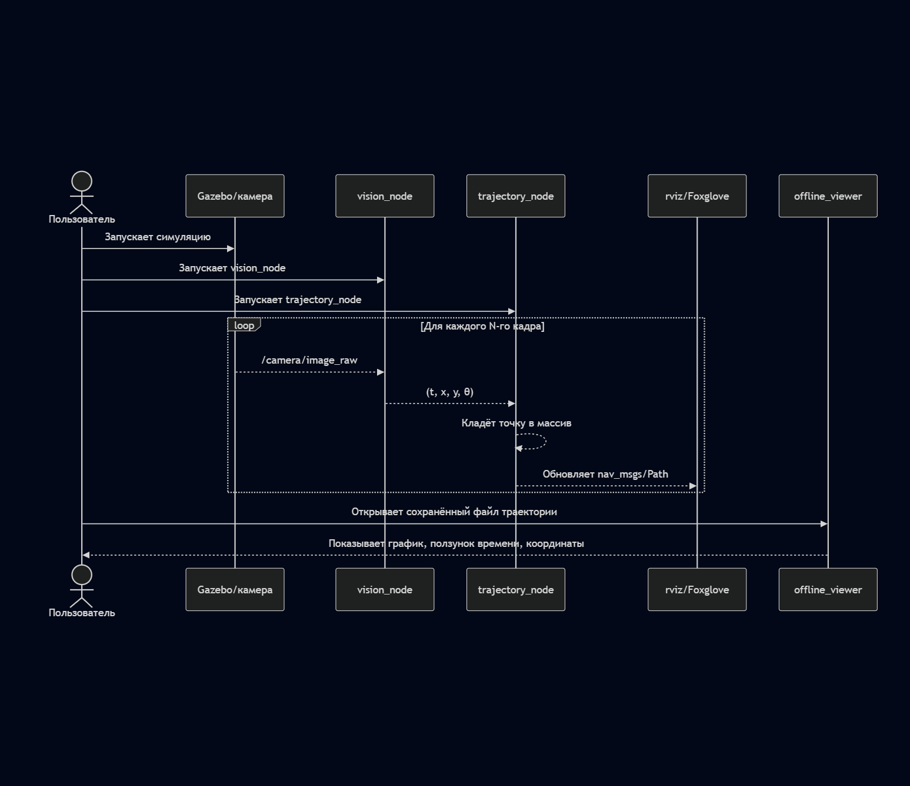

# Реализация алгоритма детекции позиции робота по внешней камере с использованием цветных меток

## 1. Общее описание проекта

Цель проекта — по видеопотоку с внешней камеры в реальном времени восстанавливать положение робота в фиксированной системе абсолютных координат и визуализировать его траекторию движения.

Для этого:

- На робота крепятся цветные метки.
- Внешняя камера смотрит на рабочую область (пол), которая лежит в одной плоскости (z = 0).
- Python обрабатывает кадры камеры, находит метки и пересчитывает координаты относительно абсолютной точки.
- Полученная последовательность точек (время, x, y, угол ориентации) используется для построения траектории:
  - в ROS;
  - в отдельном Python-просмотрщике траектории (Matplotlib), с возможностью "прокрутки" движения по времени.

---

## Updated Plan

**Важно**: В текущей реализации мы НЕ используем ручную разметку/клики по точкам и НЕ работаем с реальной камерой.

**Подход к получению абсолютных координат**:
- Используем Gazebo симуляцию с внешней камерой как sensor
- Получаем `camera_info` (intrinsics камеры) автоматически из топика `/camera/camera_info`
- Получаем позу камеры в мире через статический TF transform (`world` → `camera_link`)
- Для каждого обнаруженного пикселя метки (u, v):
  - Строим луч в пространстве камеры используя camera intrinsics (unproject)
  - Преобразуем луч в мировую систему координат через TF transform
  - Пересекаем луч с плоскостью пола (z = 0.0) для получения 3D точки в мире

Таким образом, калибровка происходит автоматически на основе известных параметров камеры и её позы, без ручного вмешательства.

---

## 2. Что будет видеть пользователь

### 2.1 Основной сценарий

Пользователь видит:

1. **Окно симуляции Gazebo** (или реальная камера, если использовать физический сетап):
   - виртуальный робот;
   - виртуальная внешняя камера, направленная на арену (пол);
   - цветные метки на роботе визуализируются как части модели.

2. **rviz / Foxglove**:
   - 2D/3D вид сцены;
   - позицию робота в виде стрелки / модели;
   - линию траектории движения (nav_msgs/Path);
   - обновление траектории по мере движения робота.

3. **Оффлайн-просмотрщик траектории (Python + Matplotlib)**:
   - график 2D-траектории в плоскости (ось X и Y — абсолютные координаты);
   - линия пути, на которой:
     - отмечено начало и конец движения;
     - есть ползунок по времени: двигая ползунок, пользователь видит, в какой точке траектории был робот в конкретный момент;
     - при клике по точке траектории (или при наведении) отображаются:
       - координаты (x, y);
       - отметка времени t, когда робот там находился.

4. **Информация по кадрам (кадровая дискретизация)**:
   - мы берем каждый N-й кадр;
   - рядом с графиком может быть:
     - окно с текущим кадром (с подсветкой цветных меток и центров);
     - подпись: номер кадра, время, текущие координаты.

Пользователь по сути видит:
- видео или симуляцию;
- текущую позицию робота в координатах;
- “следы” движения — траекторию;
- возможность исследовать траекторию постфактум (оффлайн).

---

## 3. Архитектура системы и схемы

### 3.1 Общая схема компонентов

### 3.3 Внутренний пайплайн обработки кадра

## 4. Формализация задач и оценка времени

### 4.1 Разбивка задач

| №  | Задача                                   | Описание                                                                                                                                                                    | Оценка времени   |
|----|------------------------------------------|-----------------------------------------------------------------------------------------------------------------------------------------------------------------------------|------------------|
| 1  | Анализ требований и проектирование       | Уточнение формата входных данных (видео / ROS topic), формата выходных данных ((t, x, y, θ), Path), выбор подхода к калибровке и детекции цвета. Подготовка документа и UML/Mermaid-схем. | 6–8 часов        |
| 2  | Создание ROS-пакета и инфраструктуры     | Скелет ROS-пакета, `CMakeLists.txt`, `package.xml`, базовые ноды-заглушки, launch-файлы, интеграция с Gazebo (камера, робот).                                               | 8–10 часов       |
| 3  | Модуль чтения видеопотока                | Нода, подписывающаяся на `/camera/image_raw` или читающая видео/кадр; задание частоты обработки (каждый N-й кадр).                                                          | 4–6 часов        |
| 4  | Модуль детекции цветных меток (CV)       | Перевод в HSV, подбор порогов по цвету, поиск blob-ов, вычисление центров двух меток (голова/хвост), тесты на разных кадрах.                                               | 10–12 часов      |
| 5  | Калибровка камеры и мировые координаты   | Использование camera_info (intrinsics) + TF transform для получения позы камеры + ray-plane intersection с плоскостью z=0 для вычисления мировых координат (без ручной калибровки). | 10–12 часов      |
| 6  | Оценка положения робота                  | По двум меткам вычисляем центр робота и угол ориентации θ, формируем структуру `(t, x, y, θ)`.                                                                             | 4–6 часов        |
| 7  | Сбор траектории                          | Хранение массива точек `(t, x, y, θ)`, экспорт в CSV/JSON, публикация в ROS в виде `nav_msgs/Path`.                                                                        | 4–6 часов        |
| 8  | Визуализация в rviz/Foxglove             | Настройка отображения: path, текущий pose, базовое оформление конфигурации rviz/Foxglove-пресета.                                                                          | 4–6 часов        |
| 9  | Оффлайн-визуализатор (Matplotlib)        | Чтение CSV/JSON, рисование 2D-траектории, реализация ползунка по времени и вывода координат и времени при выборе точки.                                                    | 8–10 часов       |
| 10 | Тестирование и отладка                   | Проверка на разных траекториях, корректность координат, погрешности калибровки, подготовка сценария демонстрации.                                                          | 8–12 часов       |
| 11 | Итоговая документация                    | README, описание запуска, скриншоты/графики, обновление UML/Mermaid по факту реализации.                                                                                   | 6–8 часов        |

Итого примерно **60–80 часов**.

---

## 5. Распределение ролей в команде

### 5.1 Роли

**TL**

- общая архитектура;
- ведение GitLab/GitHub, код-ревью;
- написание документации и поддержка диаграмм;
- контроль сроков и интеграции модулей.

**Computer Vision / Геометрия (Dev 2)**

- реализация детекции цветных меток (OpenCV, пороги);
- реализация преобразования пикселей в мировые координаты через camera intrinsics + TF + ray-plane intersection;
- модуль пересчёта пиксельных координат в мировые (x, y) и ориентацию θ.

**ROS-интеграция и симуляция (Dev 3)**

- создание ROS-пакета;
- настройка Gazebo: модель робота, внешняя камера, публикация `/camera/image_raw`;
- нода чтения видеопотока, публикация `/robot_pose` и `nav_msgs/Path`;
- настройка rviz/Foxglove.

**Визуализация и UX (Dev 4)**

- оффлайн-визуализатор траектории (Python + numpy + matplotlib);
- реализация ползунка по времени;
- подписывание координат и времени при выборе точки на кривой;
- подготовка скриншотов и демо-сценария.
